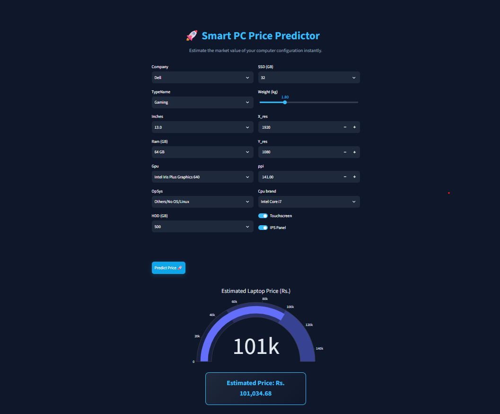
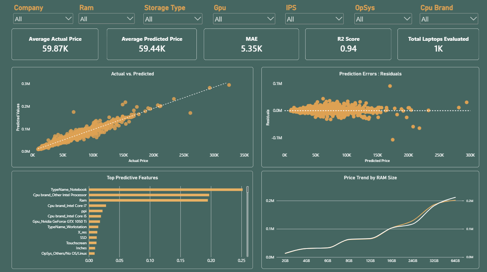

# Laptop-Price-Predictor
A machine learning-powered web application built with Streamlit and XGBoost that predicts laptop market prices based on core hardware specifications and brand features. Features an interactive user interface with dynamic data visualizations and real-time valuation estimates.


   ## 💻 Project Preview



---

## 🚀 Laptop Price Predictor Web App

An interactive machine learning web application built with **Streamlit** and **Python** to predict laptop market prices based on core hardware specifications. 

### ⚙️ Input Features
The application accepts the following hardware parameters to calculate accurate pricing:
* **Brand & Model:** The manufacturer and specific series of the laptop.
* **Processor (CPU):** Brand, tier, and generation of the processor.
* **RAM & Storage:** Memory capacity (GB) and storage type (SSD/HDD).
* **Display:** Screen size and resolution specs.
* **GPU & Operating System:** Dedicated/integrated graphics card and installed OS.

### 💡 How to Use
1. Adjust the sidebar inputs and dropdown selectors to match your desired laptop configuration.
2. View the real-time predicted price dynamically updated in the main panel.
3. Use the insights to compare how different hardware upgrades impact overall cost.

   ## 📊 Dashboard Preview
> Interactive Power BI recruitment dashboard showcasing XGBoost price predictions ($R^2$: 0.94), RAM price trends and many more.........



## Tech Stack
* **Python**
* **Streamlit**
* **XGBoost / Scikit-Learn**
* **Plotly**
* **Pandas & NumPy**

## How to Run Locally
1. Clone this repository.
2. Install the requirements:
   ```bash
   pip install -r requirements.txt
